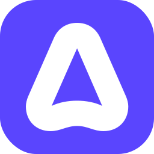
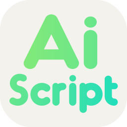
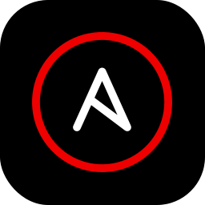
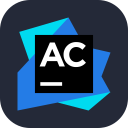
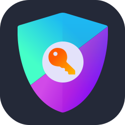

# Skills

## A-
|                 Icon ID                 |                       Icon Light                       |                       Icon Dark                       |
|:---------------------------------------:| :-----------------------------------------------------:|:-----------------------------------------------------:|
|`ableton`                                |        |        |
|`acrobat`                                |              |             |
|`activitypub`                            |    |    |
|`actix`                                  |          |          |
|`adobespark`                             |           |          |
|`adonis`                                 |               |              |
|`aero`                                   |                 |                |
|`aftereffects`                           |         |        |
|`aiscript`                               |       |       |
|`alacritty`                              |      |      |
|`alchemy`                                |        |        |
|`alpinejs`                               |       |       |
|`anaconda`                               |       |       |
|`android`                                |        |        |
|`androidstudio`                          |  |  |
|`angular`                                |        |        |
|`animate`                                |              |             |
|`ansible`                                |              |             |
|`anss`                                   |           |           |
|`api`                                    |            |            |
|`apidog`                                 |         |         |
|`apollo`                                 |               |              |
|`appcode`                                |        |        |
|`apple`                                  |          |          |
|`appwrite`                               |             |            |
|`aqua`                                   |           |           |
|`arcbrowser`                             |     |     |
|`arch`                                   |           |           |
|`arduino`                                |              |             |
|`argocd`                                 |         |         |
|`assembly`                               |             |            |
|`astro`                                  |                |               |
|`atom`                                   |                 |                |
|`audition`                               |             |            |
|`authjs`                                 |         |         |
|`autocad`                                |        |        |
|`avaloniaui`                             |           |          |
|`aws`                                    |            |            |
|`azul`                                   |                 |                |
|`azure`                                  |          |          |
|`azuredevops`                            |    |    |

